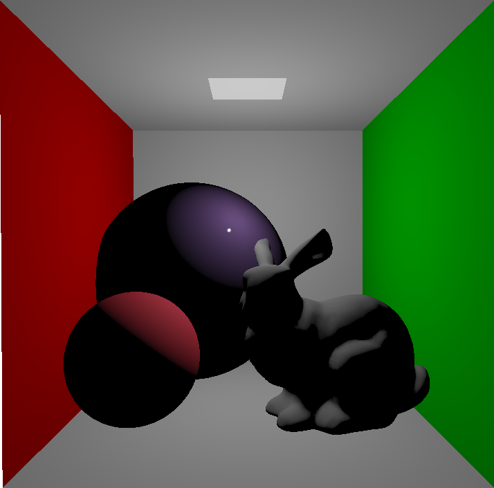
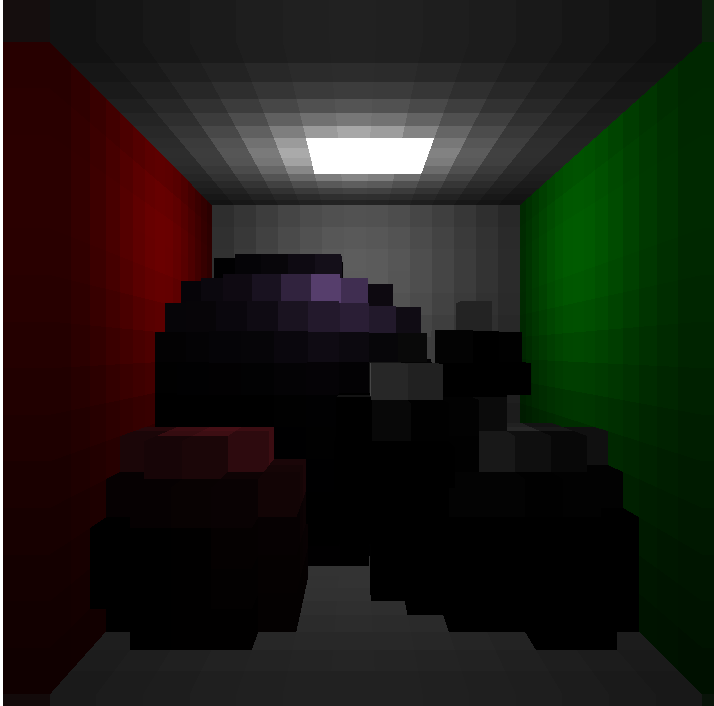
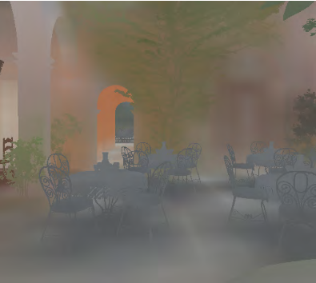
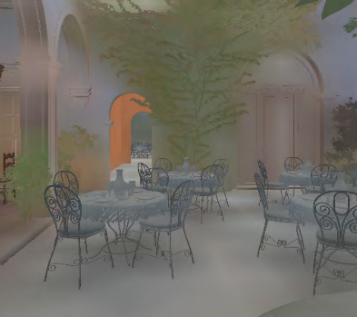
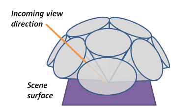
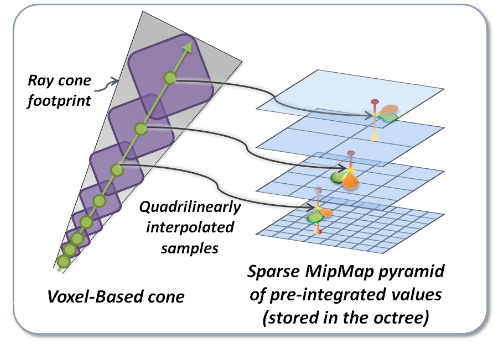
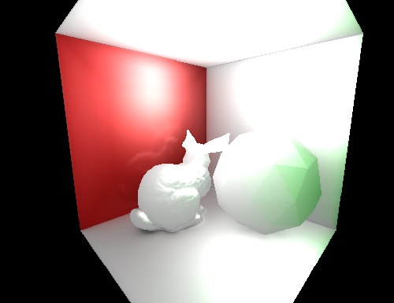

# Voxel Cone Traced Global Illumination
This is my attempt (which is still in development) of implementing Real-Time global illumination using voxel cone tracing.

This work also serves to show me how to correctly write abstraction over vulkan. More on that later.

## About the method
Idea introduced in 2011 by [Cyrill Crassin et al.](https://research.nvidia.com/sites/default/files/publications/GIVoxels-pg2011-authors.pdf) uses voxels to approximate global illumination, bringing the technique into the realm of real-time rendering.

First, one should voxelize the scene. There are two main ways: sparse voxel octrees, plain old 3D texture. I chose the latter for simplicity, ease of implementing and ability to support moving position of the camera because of no high cost of octree reconstruction. Here is how the scene would look like:
Normal Scene | Voxelized Scene
:--:|:--:
 | 

*Source: [https://jose-villegas.github.io/post/deferred_voxel_shading/](https://jose-villegas.github.io/post/deferred_voxel_shading/)*

In this step I gather information like: surface color, surface normal, surface emission etc.
Here it is also important to mention the **Conservative Rasterization**, which in vulkan is very easy to toggle, but in OpenGL needs manual intervention.
Conservative rasterization ensures there are no holes in the voxelized mesh. Holes can appear when rasterized triangle doesn't cover the center of a pixel, which makes it to be discarded and so will not get recorded into the voxel texture. Triangles are projected in the geometry shader based on the greatest compomnent of the normal vector (you may want to recalculate it when using projection matrix). So, for example, if the Z component is the greates, we project the triangle on the XY plane because on this one it has the biggest area covered and consequently will produce the highest amount of rasterized fragments.

Now, when saving the values into the 3D texture, you have to be aware that shaders are running concurrently in warps, which means parts of your texture will be accessed and written-to from multiple threads in unsynchronized manner.
To alleviate this, as far as I know, you have to options:
use CAS-loop with moving averade, and convert your RGBA8 into R32UI beforhand, as explained in [OpenGL Insights, Chapter22, Page 344](https://xeolabs.com/pdfs/OpenGLInsights.pdf), or, if you're on NVidia, enable the `NV_shader_atomic_float`, which introduces functions `imageAtomicAdd` that work on floats.

The next step is to combine gathered data into single 3D texture, that will essentialy store view-independent radiance of the scene. Here we will take scene's lights into account, as well as voxelized colors, normals and emissision. It is also possible to calculate shadows and bake them into the resulting texture.

The last step is to create mip maps of this texture with our scene's radiance using trilinear interpolation. Here it also good place to consider creating anisotropic mip maps, which help reduce light bleeding. The implementation is described in [GigaVoxels: A Voxel-Based Rendering Pipeline For Efficient Exploration Of Large And Detailed Scenes](https://www.researchgate.net/publication/268023043_GigaVoxels_A_Voxel-Based_Rendering_Pipeline_For_Efficient_Exploration_Of_Large_And_Detailed_Scenes), and the result they give can be seen in the picture below:
Isotropic voxels | Anisotropic voxels
:--:|:--:
 | 

*Source: [GigaVoxels: A Voxel-Based Rendering Pipeline For Efficient Exploration Of Large And Detailed Scenes](https://www.researchgate.net/publication/268023043_GigaVoxels_A_Voxel-Based_Rendering_Pipeline_For_Efficient_Exploration_Of_Large_And_Detailed_Scenes)*

## Lighting
After creating mip maps, we are ready to draw our scene.
From each fragment we shoot a few cones around the hemisphere oriented along the surface's normal vector as pictured:

You then average the result, just like in Monte Carlo solution, and each partial result can be weighted with cosine similarity weighting using the deviation from the surface's normal vector.

*Source: [Cyrill Crassin et al.](https://research.nvidia.com/sites/default/files/publications/GIVoxels-pg2011-authors.pdf)*

Usually, there are 3 types of cones with varying aperture: diffuse cones, specular cones, ambient occlusion cones. Diffuse cones approximate the general "ambient" radiance and will much have bigger aperture than specular cones, which operate in the lower mip maps with smaller aperture.

The aperture of the cone determines the speed with which the diameter will increase as the distance from the surface grows. The diameter is the primary selector of the appropriate mipmap, which can be seen below:

*Source: [Cyrill Crassin et al.](https://research.nvidia.com/sites/default/files/publications/GIVoxels-pg2011-authors.pdf)*

Traversing the voxel structure uses the classical front-to-back accumulation given as: 

 `color = opacity*color + (1 - opacity) * read_opacity * read_color`

 and

 `opacity = opacity + (1 - opacity) * read_opacity`.

# My results
Here are my current results:

The image above was rendered in 1024x768 resolution, the scene contains ~70000 triangles. Each fragment averages the result of 16 diffuse cones, 1 specular cone and produces soft shadows in creases and around occluders.
The averaged frame times, gathered from 800 frames, in milliseconds, measerued with timestamp hardware queries, are as follows:
Voxelization | Radiance volume | Isotropic mipmaps | Lighting
:--:|:--:|:--:|:--:|
0.97ms|4.96ms|0.09ms|5.1ms

Do keep in mind, that for static scenes, voxelization, radiance volume computation and isotropic mipmaps need not recalculating, and as such, only the lighting pass should happen. The times given above, especially in the lighting pass, will change, for the better I hope, as I optimize the code and tune the parameters.

The demo can be downloaded in the Releases section.

# To-do
- [ ] Anisotropic voxels
- [ ] Swapchain resizing
- [x] Render graph for layout transitions and cache invalidations and flushes
- [ ] Deletion queue
- [ ] Proper materials
- [ ] Scene graph
- [ ] More lights
- [ ] Clipmaps for bigger scenes
- [ ] Textures

# Summary
The technique feels very natural and easy to work with. In fact, it was actually used in a video game "The Tomorrow Children". I still have a lot of work to do, especially with Vulkan, but the project at this stage already showed, where the proper API abstractions are needed, and now I know specifically, what job they need to do, which a lack thereof is a bane of many aspiring engine designers.

# How to compile the project
- Clone the repo
- Download git submodules with `git submodule update --init --jobs 12 --depth 1`
- Configure the project with CMake
- Compile the project

Last two steps can be simplified by opening the project folder with VSCode with CMakeTools extension

# Used libraries
- [fastgltf](https://github.com/spnda/fastgltf)
- [glfw](https://github.com/glfw/glfw#head1234)
- [glm](https://github.com/g-truc/glm)
- [dear imgui](https://github.com/ocornut/imgui)
- [stb_image stb_include](https://github.com/nothings/stb)
- [spdlog](https://github.com/gabime/spdlog)
- [vk-bootstrap](https://github.com/charles-lunarg/vk-bootstrap)
- [VulkanMemoryAllocator](https://github.com/GPUOpen-LibrariesAndSDKs/VulkanMemoryAllocator)
